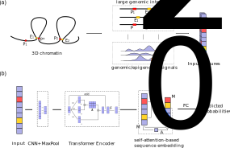

# TransEPI: Capturing large genomic contexts for accurately predicting enhancer-promoter interactions

The codes and datasets for [Capturing large genomic contexts for accurately predicting enhancer-promoter interactions](https://www.biorxiv.org/content/10.1101/2021.09.04.458817v1).

TransEPI is a Transformer-based model for EPI prediction. 
This repository contains the scripts, data, and trained models for TransEPI.




# Requirements  

* numpy  
* tqdm  
* scikit-learn  
* PyTorch>=1.9.0 (recommended) or PyTorch 1.6.0+  
* pyBigWig (optional, required by `prepare_bw_signals.py` for preparing features)


# Datasets  

All the datasets used in this study are available at [data/BENGI](data/BENGI) and [data/HiC-loops](data/HiC-loops).  


# Quick start

1. Clone the codes: 
```
git clone git@github.com:biomed-AI/TransEPI.git
```

2. Download processed genomic features

- Download the genomic features from [Synapse:syn26156164](https://www.synapse.org/#!Synapse:syn26156164) 
- Edit the feature configuration file `./data/genomic_data/CTCF_DNase_6histone.500.json` to specifiy the locations of the genomic feature files downloaded from Synapse. *Absolute path is required!*  

3. Run the model
```
cd TransEPI/src
python ./evaluate_model.py \
	-t ../data/BENGI/HMEC.HiC-Benchmark.v3.tsv.gz \  # samples to be predicted
	-c ../models/TransEPI_EPI.json \                 # configuration file
        --gpu 0 \                                        # GPU ID, set it to -1 to use CPU
	-m ../models/TransEPI_EPI_fold0.pt \             # model file
	-p output                                        # prefix of the output
```
The predictions will be available at `output.prediction.txt`


# Step-by-step guide

## Prepare genomic data (for cell types not included in [Synapse:syn26156164](https://www.synapse.org/#!Synapse:syn26156164))  
1. Download the genomic data required by TransEPI from [ENCODE](https://www.encodeproject.org/) or [Roadmap](https://egg2.wustl.edu/roadmap/web_portal/processed_data.html#ChipSeq_DNaseSeq)  
    - CTCF ChIP-seq data in narrowPeak format
    - DNase-seq data in bigWig format
    - H3K27me3, H3K36me3, H3K4me1, H3K4me3, and H3K9me3 ChIP-seq data in bigWig format

2. Edit `TransEPI/data/genomic_data/bed/CTCF_bed.json` and `TransEPI/data/genomic_data/bigwig/bw_6histone.json` to specify the location of the narrowPeak and bigWig files  

3. Convert narrowPeak and bigWig signals to `.pt` files  
```
cd TransEPI/data/genomic_data
bash ./pipeline.sh
```
4. Add the `.pt` files generated by step 3 to `TransEPI/data/genomic_data/CTCF_DNase_6histone.500.json` 

**Summary**  
- The location of raw narrowPeak and bigwig files should be specified in `TransEPI/data/genomic_data/bed/CTCF_bed.json` and `TransEPI/data/genomic_data/bigwig/bw_6histone.json`. 
- The processed data files should be specified in `TransEPI/data/genomic_data/CTCF_DNase_6histone.500.json`

## Prepare the configuration file for model training
The configuration file should be in `.json` format:
```
{
    "data_opts": {	// dataset configuration
        "datasets": [ 	// datasets used to train the model (required by cross_validate.py and it will be ignored in evaluate_model.py)
            "../data/BENGI/GM12878.CTCF-ChIAPET-Benchmark.v3.tsv",
            "../data/BENGI/GM12878.HiC-Benchmark.v3.tsv",
            "../data/BENGI/GM12878.RNAPII-ChIAPET-Benchmark.v3.tsv",
            "../data/BENGI/HeLa.CTCF-ChIAPET-Benchmark.v3.tsv",
            "../data/BENGI/HeLa.HiC-Benchmark.v3.tsv",
            "../data/BENGI/HeLa.RNAPII-ChIAPET-Benchmark.v3.tsv"
        ],
        "feats_order": ["CTCF", "DNase", "H3K4me1", "H3K4me3", "H3K36me3", "H3K9me3",  "H3K27me3"], //  the order of features (do not change the order if you run the models provided by us)
        "feats_config": "../data/genomic_data/CTCF_DNase_6histone.500.json", // location of genomic data configuration file
        "bin_size": 500,        // bin sise used by TransEPI
        "seq_len": 2500000      // the size of large genomic context
    },

    "model_opts": {	// EPI model configuration
        "model": "TransEPI",
        "cnn_channels": [180],
        "cnn_sizes": [11],
        "cnn_pool": [10],
        "enc_layers": 3,
        "num_heads": 6,
        "d_inner": 256,
        "da": 64,
        "r": 32,
        "att_C": 0.1,
        "fc": [128, 64],
        "fc_dropout": 0.2
    },

    "train_opts": {	// model training configuration
        "learning_rate": 0.0001,
        "batch_size": 128,
        "num_epoch": 300,
        "patience": 10,
        "num_workers": 16,
        "use_scheduler": false
    }
}
```
**Note**: The comments marked with `//` are only used to illustrate the contents in the configuration file. They should not be included in the configuration file because the `.json` format does not support comments.  

## Prepare input files  

The input to the TransEPI model should be formatted like:  

```
1	572380.0	chr5	317258	317610	chr5:317258-317610|GM12878|EH37E0762690	chr5	889314	891314	chr5:889813-889814|GM12878|ENSG00000028310.13|ENST00000388890.4|-
0	100101.0	chr5	317258	317610	chr5:317258-317610|GM12878|EH37E0762690	chr5	216833	218833	chr5:217332-217333|GM12878|ENSG00000164366.3|ENST00000441693.2|-	316258-318610
0	100101.0	chr5	317258	317610	chr5:317258-317610|GM12878|EH37E0762690	chr5	216833	218833	chr5:217332-217333|GM12878|ENSG00000164366.3|ENST00000441693.2|-	316258-318610;416258-418610
```

The input file should be `tab` separated and the fields are:  

    1. label: for datasets without known labels, set it to 0
    2. distance: the between the enhancer and the promoter
    3. e_chr: enhancer chromosome
    4. e_start: enhancer start
    5. e_end: enhancer end
    6. e_name: enhancer name, cell type is required be noted in the second field in enhancer name (seperated by `|`): e.g. chr5:317258-317610|GM12878|EH37E0762690
    7. p_chr: promoter chromosome
    8. p_start: promoter start
    9. p_end: promoter end
    10. p_name: promoter name
    11. mask region (optional): the feature values in the mask regions will be masked (set to 0)


## Train the model  
- cross validation  
```
python cross_validate.py \
	-c config.json \  # the json file prepared in "Preparing the configuration file for training model"
	--gpu 0 		  # GPU ID, set it to -1 to use CPU
	-o outdir 		  # output directory
```

# Models  

The trained models are available at [models](./models).   


# Reproducibility  

To reproduce the major results shown in the manuscripts, see [dev/run_cv.sh](./dev/run_cv.sh) (cross validation) and [dev/run_pred.sh](./dev/run_pred.sh) (evaluation).


# Experimental feature
Replace `epi_dataset.py` with the `src/epi_variable_dataset.py` to enable TransEPI supporting variable length input

# Questions
For questions about the datasets and code, please contact [chenkenbio@gmail.com](mailto:chenkenbio@gmail.com) or create an issue.

# Citation

```
@article {Chen2021.09.04.458817,
	author = {Chen, Ken and Zhao, Huiying and Yang, Yuedong},
	title = {Capturing large genomic contexts for accurately predicting enhancer-promoter interactions},
	elocation-id = {2021.09.04.458817},
	year = {2021},
	doi = {10.1101/2021.09.04.458817},
	publisher = {Cold Spring Harbor Laboratory},
	URL = {https://www.biorxiv.org/content/early/2021/09/06/2021.09.04.458817},
	eprint = {https://www.biorxiv.org/content/early/2021/09/06/2021.09.04.458817.full.pdf},
	journal = {bioRxiv}
}
```
